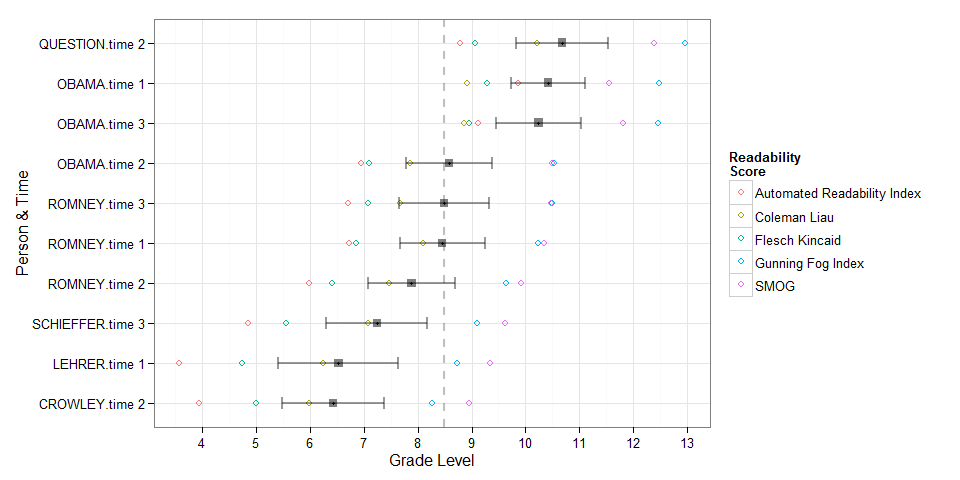

readability
============

**readability** utilizes the
[**syllable**](https://github.com/trinker/syllable) package for fast
calculation of readability scores by grouping variables.

Table of Contents
============

-   [Installation](#installation)
-   [Contact](#contact)
-   [Examples](#examples)

Installation
============

To download the development version of **readability**:

Download the [zip
ball](https://github.com/trinker/readability/zipball/master) or [tar
ball](https://github.com/trinker/readability/tarball/master), decompress
and run `R CMD INSTALL` on it, or use the **pacman** package to install
the development version:

    if (!require("pacman")) install.packages("pacman")
    pacman::p_load_gh("trinker/syllable", "trinker/readability")

Contact
=======

You are welcome to: 
* submit suggestions and bug-reports at: <https://github.com/trinker/readability/issues> 
* send a pull request on: <https://github.com/trinker/readability/> 
* compose a friendly e-mail to: <tyler.rinker@gmail.com>

Examples
========

    if (!require("pacman")) install.packages("pacman")
    pacman::p_load(syllable, readability)

    (x <- with(presidential_debates_2012, readability(dialogue, list(person, time))))

    ##        person   time Flesch_Kincaid Gunning_Fog_Index Coleman_Liau SMOG
    ##  1:  QUESTION time 2            9.1              13.0         10.2 12.4
    ##  2:     OBAMA time 1            9.3              12.5          8.9 11.5
    ##  3:     OBAMA time 3            8.9              12.5          8.9 11.8
    ##  4:     OBAMA time 2            7.1              10.5          7.9 10.5
    ##  5:    ROMNEY time 3            7.1              10.5          7.7 10.5
    ##  6:    ROMNEY time 1            6.9              10.2          8.1 10.3
    ##  7:    ROMNEY time 2            6.4               9.6          7.5  9.9
    ##  8: SCHIEFFER time 3            5.6               9.1          7.1  9.6
    ##  9:    LEHRER time 1            4.7               8.7          6.2  9.3
    ## 10:   CROWLEY time 2            5.0               8.3          6.0  9.0
    ##     Automated_Readability_Index Average_Grade_Level
    ##  1:                         8.8                10.7
    ##  2:                         9.9                10.4
    ##  3:                         9.1                10.2
    ##  4:                         7.0                 8.6
    ##  5:                         6.7                 8.5
    ##  6:                         6.7                 8.5
    ##  7:                         6.0                 7.9
    ##  8:                         4.9                 7.2
    ##  9:                         3.6                 6.5
    ## 10:                         3.9                 6.4

    plot(x)

